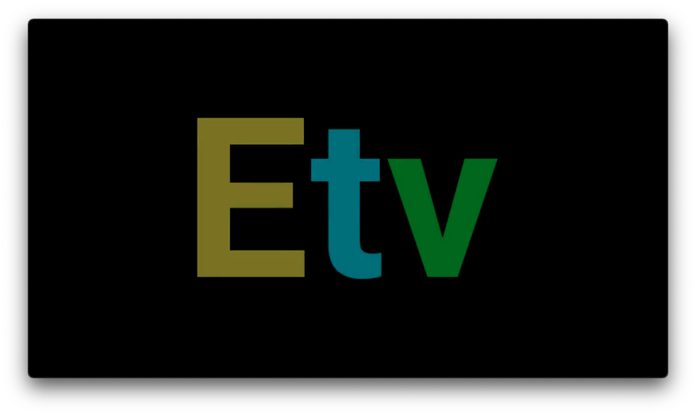

# ErsatzTV-Filler Filler Types and Setup (Channel-Logo)

## What is it?

Channel Logo filler is a great way to get a bit of variety in your channels by showing the channel logo of the associated channel in a filler video.

## How does it work?

The Channel Logo filler uses the xmltv grabbed from ErsatzTV to find the channels logo and then inserts the logo into a filler video.

## How do I set it up?

1. On the first run, a video for each channel will be created. This video will include the channel logo.

2. If a new channel is added, its video will be created during the next scheduled run or it can be run manually from the web interface or API.

3. You will need to add each `{channelnumber}-logo.mp4` file created automatically to the other videos library and add each one you use to a collection by itself, as long as each channel has its own offline collection with only that `channellogo` video in it or you will see the wrong logo on the wrong channel.

4. This collection would then be scheduled as the desired filler types on the correct channel in order to display the correct logo.
